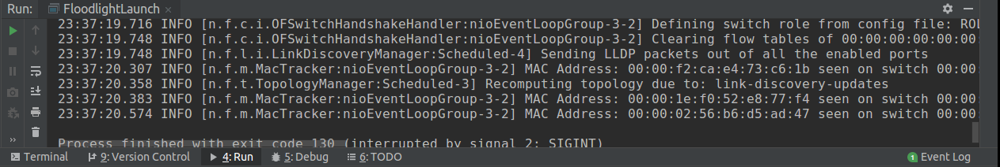

# MacTracker
[https://floodlight.atlassian.net/wiki/spaces/floodlightcontroller/pages/1343513/How+to+Write+a+Module](https://floodlight.atlassian.net/wiki/spaces/floodlightcontroller/pages/1343513/How+to+Write+a+Module)

## 在Intellij IDEA中完成开发
- 在`Project`的`main/java/net/floodlightcontroller`下创建一个名为`mactracker`的`Package`, 并创建一个名为`MacTracker`的`Java Class`.
- 在`Project`下右键单击`main`->`Build Module 'main'`, `Run`->`Run 'FloodlightLaunch'`, 在浏览器中打开floodlight管理界面，可以在`Controller(Home)`的`Modules Loaded`和`All Modules`选项下看到`mactracker.MacTracker`已正确加载.

## 注册模块`MacTracker`
- 在`src/main/resources/META-INF/services/net.floodlightcontroller.core.module`文件的最后加上如下代码:
```
net.floodlightcontroller.mactracker.MacTracker
```

- 修改Floodlight的配置文件，添加`MacTracker`模块相关信息. Floodlight的缺省配置文件是`src/main/resources/floodlightdefault.properties`, 在`floodlight.modules`选项下添加如下代码:
```
net.floodlightcontroller.mactracker.MacTracker
```

## 测试
- 在Intellij IDEA中的`Project`下右键单击`main`->`Build Module 'main'`,`Run`->`Run 'FloodlightLaunch'`, 在浏览器中打开floodlight管理界面，可以在`Controller(Home)`的`Modules Loaded`和`All Modules`选项下看到`mactracker.MacTracker`已正确加载.
- 在虚拟机中使用如下命令登录mininet:
```
$ sudo mn --controller=remote,ip=10.168.1.144,port=6653
```
即可在控制台看到输出：
