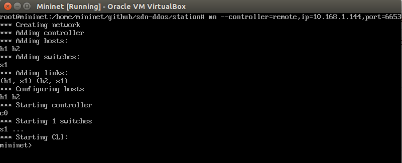
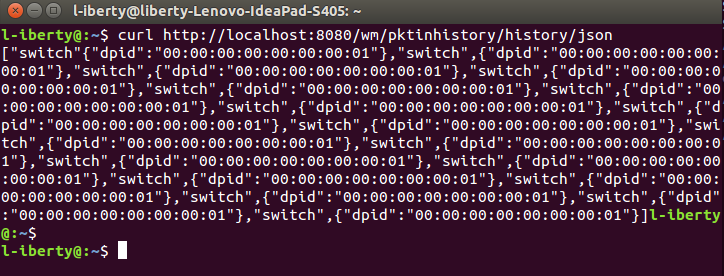

# PktInHistory
[https://floodlight.atlassian.net/wiki/spaces/floodlightcontroller/pages/1343634/How+to+Add+Services+to+a+Module](https://floodlight.atlassian.net/wiki/spaces/floodlightcontroller/pages/1343634/How+to+Add+Services+to+a+Module)

## 在Intellij IDEA中完成开发
- 在`main/java/net/floodlightcontroller`下创建一个名为`pktinhistory`的`Package`, 并创建3个`Class`:
	- `PktInHistory`
	- `PktHistoryResource`
	- `PktInHistoryWebRoutable`
- 在`main/java/net/floodlightcontroller/core/web/serializers`下创建一个名为`SwitchMessagePairSerializer`的`Class`
- 修改`main/java/net/floodlightcontroller/core/types/SwitchMessagePair.java`: 在类声明前添加如下代码:
```
@JsonSerialize(using = SwitchMessagePairSerializer.class)
```
- 在`pktinhistory`下创建一个名为`PktInHistoryService`的`Interface`.

## 注册模块`PktInHistory`
具体方法和注册`MacTracker`一样

## 测试
- 在Intellij IDEA中启动floodlight后，打开floodlight管理界面,确认`pktinhistory.PktInHistory`已经成功加载.
- 在虚拟机中登录mininet并连接到floodlight控制器:

- 通过`REST API`获取结果:

