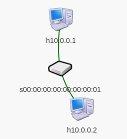
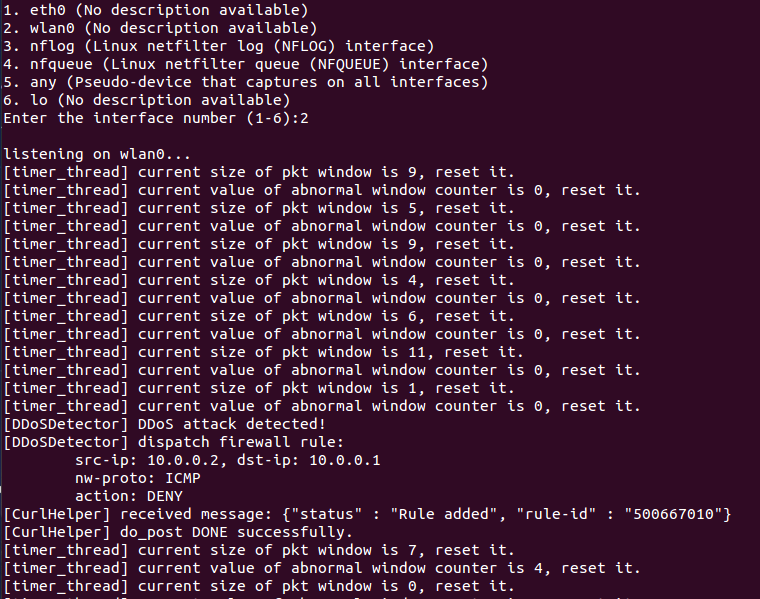
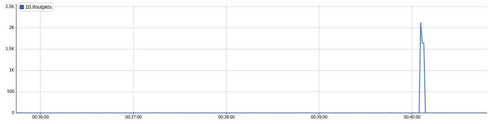
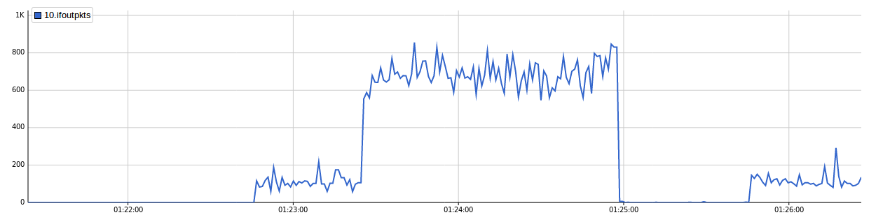
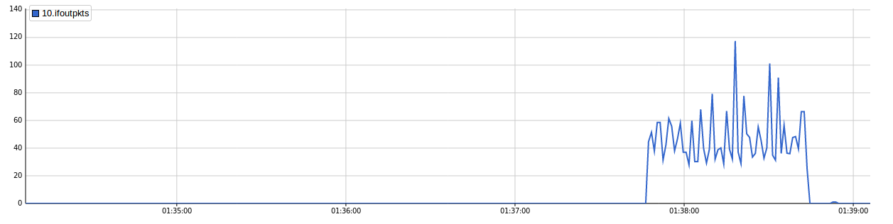

# lab-1 初步测试
[系统设计概要说明](../lab_doc/README.md)

## 实验环境准备
### 1.启动Floodlight
在`floodlight`目录下:
```
$ java -jar target/floodlight.jar
```

登录Web管理界面:
```
URL=localhost:8080/ui/index.html
```

运行`enable-conn.sh`通过北向API激活防火墙，并放行ARP,ICMP,TCP，以便后续测试.

### 2.启动sFlow Collector
在`sflow-rt`目录下:
```
$ ./start.sh
```

登录Web管理界面:
```
URL=localhost:8008/html/index.html
```

### 3.启动虚拟机`Mininet`
#### (1)使用`run-mn.sh`启动mininet,为简单起见直接使用默认的网络拓扑:


#### (2)使用`ovs-setting.sh`配置sFlow

#### (3)在mininet交互模式下键入`xterm nr_host`(如`xterm h1`)打开虚拟主机的终端，便于单独操作

#### (4)测试sFlow采样
在`h1`的终端下`ping 10.0.0.2 -f`，如果在sFlow的Web管理页面中可以在相应接口看到流量的激增，说明sFlow采样正常

## 实验步骤
### (1)测试累积效应
用于实现DDoS攻击的数据包如果单个来看的话都是正常的网络流量，但如果这类数据包在短时间内大量涌现，就会形成DoS攻击。如果来自客户端的这类数据包并非用作攻击，比如通过ICMP请求测试连通性，或通过TCP-SYN实现TCP连接，但这类流量会被归到异常流量窗口里，当窗口长度缓慢地累计到阈值时，防御系统就会针对这些流量下发防火墙规则，使得后续的合法流量被拦截。为了解决这个问题，我设计了如下机制：每经过时间`T`就将异常流量窗口清空. `T`满足：异常流量窗口能在时间`T`内达到阈值，而正常流量累计到阈值的时间远大于`T`.

下面，在`h2`中`ping 10.0.0.1`. 这只是一个正常的Ping，不是泛洪攻击，因此不应该被拒绝, 防御系统未告警，日志的前半部分显示了对流量窗口的清空操作进而消除累积效应：



如果改为`ping 10.0.0.1 -f`就会触发告警（日志的后半部分），防御系统生效，通过sFlow的流量监测可知，攻击流量在短时间内达到高峰，防御系统检测到之后下发防火墙规则，阻止了攻击流量：



### (2)在正常流量中检测Ping Flood
在`h1`和`h2`上使用两个TCP客户端/服务端的持续通信来模拟正常流量，此时在`h1`上`ping 10.0.0.2 -f`, 防御系统能正常工作，`h1`无法ping通`h2`, 但二者之间的TCP通信也中断了，只能重启客户端，重新连接. 下图是上述过程的流量监测结果:



### (3)TCP-SYN Flood
使用Scapy发包, 在`h2`上启动TCP服务器, 再在`h1`上运行`syn_flood2.py`即可. 下图是流量监测结果:



也许是Scapy的原因，发包速率很低，防御系统好久才检测到，真实的SYN Flood会强很多.

## 实验结果分析
目前抵御攻击的方法都是将攻击者的源地址信息记录在防火墙规则中，通过防火墙来拒绝数据包，所以如果攻击者伪造源IP，防御系统将失效，上面的测试都是在攻击者没有伪造源IP的前提下实现的.