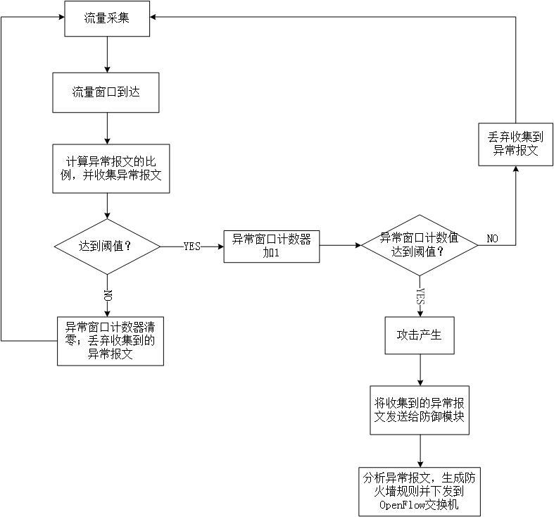
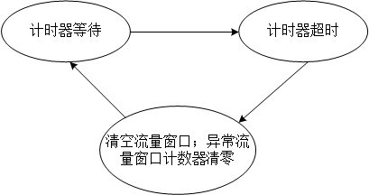

# 系统设计
## 系统的主要工作流程

以上就是整体框架，但其中还有一个并发的定时器线程，如下所述：

## 定时器的工作流程
**累积效应**：用于实现DDoS攻击的数据包如果单个来看的话都是正常的网络流量，但如果这类数据包在短时间内大量涌现，就会形成DoS攻击。如果来自客户端的这类数据包并非用作攻击，比如通过ICMP请求测试连通性，或通过TCP-SYN实现TCP连接，但这类流量会被归到异常流量窗口里，当窗口长度缓慢地累计到阈值时，防御系统就会针对这些流量下发防火墙规则，使得后续的合法流量被拦截。为了解决这个问题，我设计了如下机制：每经过时间`T`就将异常流量窗口清空. `T`满足：异常流量窗口能在时间`T`内达到阈值，而正常流量累计到阈值的时间远大于`T`.

