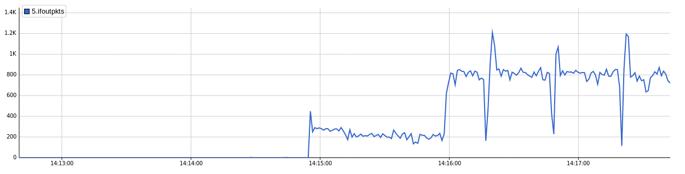
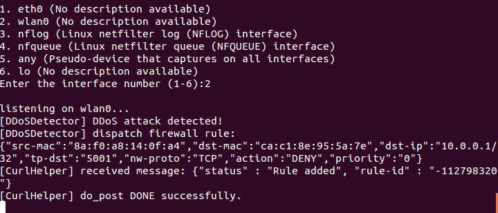
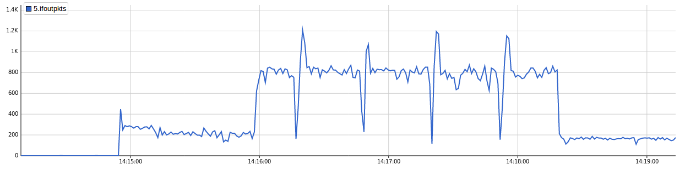

# lab-2

## 实验环境准备
如[lab-1](../1/README.md)所述，启动floodlight, sflow, mininet虚拟机, 使用`scripts/mytopo3.py`创建网络拓扑.

### 模拟网络流量
- 网络流量仅在两台主机之间产生，设为`h1`,`h2`.
- 使用`tcp/`中的`server`和`client`在`h1-h2`之间建立TCP通信，经过调试，将速率控制在*200~300 packets/s*左右.
- 使用`send_syn/`中的程序进行`TCP-SYN Flood`攻击，发包速率也经过仔细调试，从而在`h1-h2`的TCP通信环境下产生明显的流量激增. 效果如下:

具体操作：
- `h1:$ ./server 10.0.0.1 9999`, `h2:$ ./client 10.0.0.1 9999` 建立TCP流量.
- `h1:$ iperf -s`, `h2:$ ./send_syn 10.0.0.1 5001` 发起TCP-SYN Flood攻击, 其中*源IP地址*和*源端口号*随机生成, 只能通过*源MAC地址*定位攻击者（假定攻击者不伪造MAC地址）.
- 开启`DDoSDetector`, 可以立即监测到攻击并作出反应：

流量变化如下：

可以看到，攻击被阻断后流量又恢复正常.

在同样的TCP流量背景下，针对`Ping Flood`的防御则会出现[lab-1](../1/README.md)所述的问题，即正常的TCP流量会被阻断，需要重新连接; 但是`TCP-SYN Flood`&`Ping Flood`混合攻击不会，攻击被阻断后流量将恢复到攻击前的正常水平.