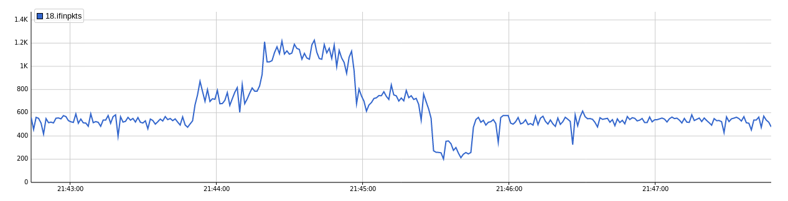

# lab-2

## 实验环境准备
如[lab-1](../1/README.md)所述，启动floodlight, sflow, mininet虚拟机, 使用`scripts/mytopo3.py`创建网络拓扑.

### 模拟网络流量
- 网络流量仅在两台主机之间产生，设为`h1`,`h2`.
- 使用`scripts/tcp`中的`server`和`client`在`h1-h2`之间建立TCP通信，经过调试，将速率控制在*500 packets/s*左右.
- 使用`scripts/send_syn`中的程序进行`TCP-SYN`攻击，发包速率也经过仔细调试，控制在*500 packets/s*左右，从而在`h1-h2`的TCP通信环境下产生明显的流量激增.
- 启动两个终端运行`send_syn`，从而产生两倍的流量，即*1000 packets/s*. 流量监测图:

如图：先后启动两个`send_syn`后观察到了两次明显的流量激增，然后依次关闭两个`send_syn`，流量又恢复到从前.