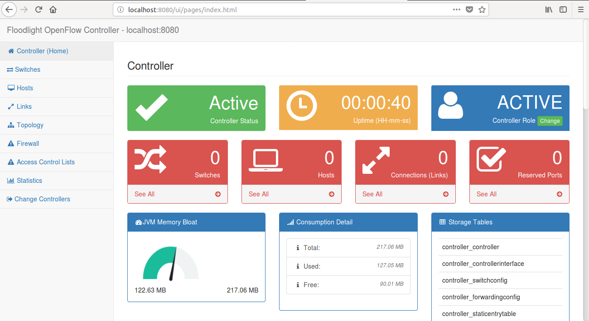
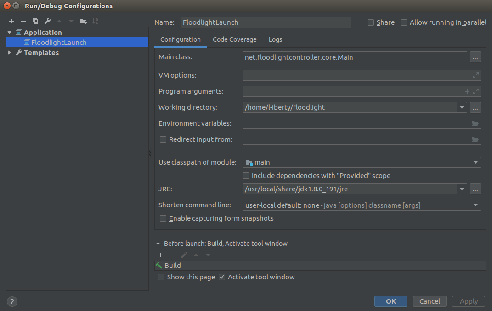
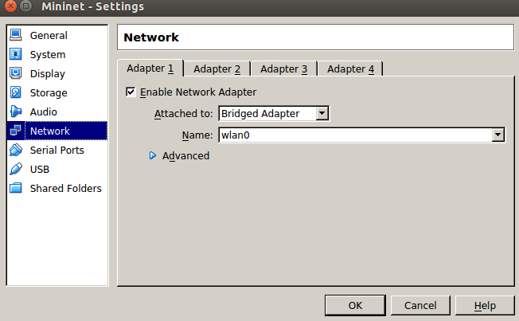
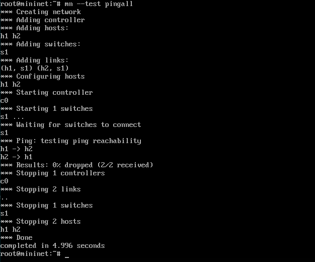
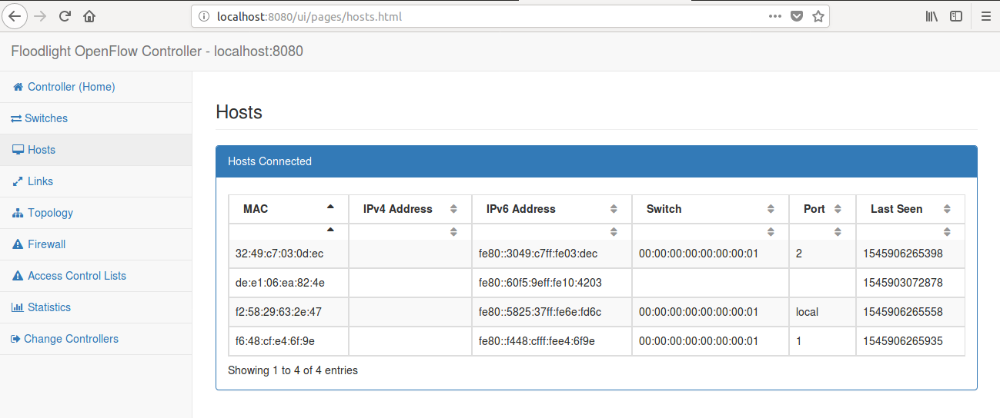
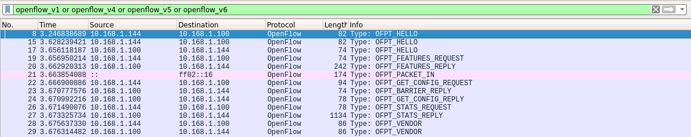
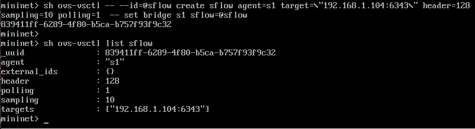
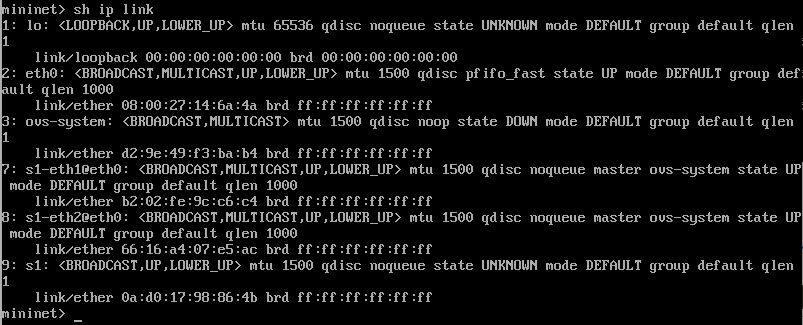
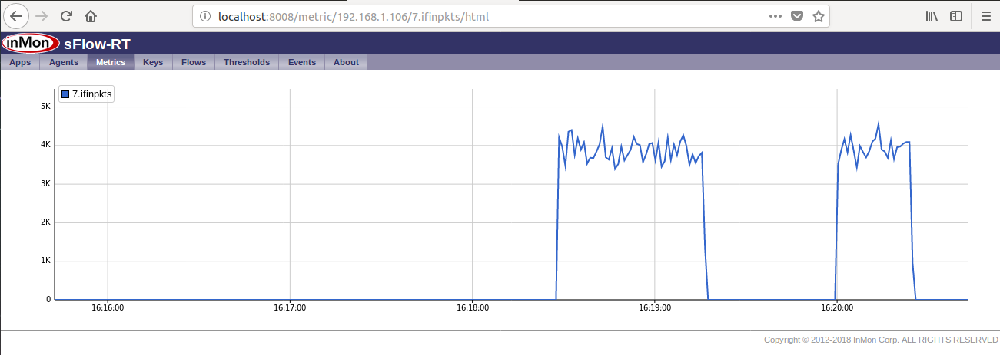
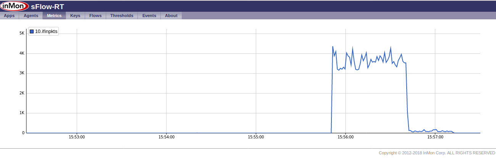

# 实验环境搭建
OS: Ubuntu 14.04.5 LTS x86_x64

## [一] Floodlight
### Download, Update and Build
```
$ git clone http://github.com/floodlight/floodlight.git
$ cd floodlight
$ git pull origin master
$ git submodule init
$ git submodule update
$ ant
```
### Running Floodlight in the Terminal
```
$ java -jar target/floodlight.jar
```

### 登录Floodlight的web管理界面
在浏览器中输入URL`localhost:8080/ui/index.html`



### Developing Floodlight in Eclipse
```
$ ant eclipse
```

This creates several files: `Floodlight.launch`, `Floodlight_junit.launch`, `.classpath`, and `.project`. 

- `Import existing projects`
- `Select root directory`选择floodlight文件夹
- 在`Project Explorer`中右键`floodlight`->`Run as`->`Run Configurations`, `Name`输入`FloodlightLaunch`，`Project`输入`floodlight`,`Main class`输入`net.floodlightcontroller.core.Main`, `Apply`并`Run`，floodlight就运行起来了，打开浏览器可以正常访问管理界面.

### Developing Floodlight in IntelliJ IDEA
- 下载并更新源码后**不要**用`ant`进行build, Idea直接从floodlight文件夹导入源码，不要使用外部框架（Eclipse,Maven,Gradle）.
- 右键单击`floodlight/src/main/resources`->`Mark Directory as`->`Resources root`.
- 进行如下配置后, `Run->Run 'Floodlight'`, floodlight就运行起来了，打开浏览器可以正常访问管理界面.



### 配置信息
缺省配置信息在`floodlight/src/main/resources/floodlightdefault.properties`，如`http`端口`8080`, `openflow`端口`6653`

***

## [二]Mininet
使用VirtualBox创建一个虚拟机，网络配置选择桥接，如下：



确保虚拟机和宿主机互相ping通

在虚拟机中下载`mininet`源码进行安装：

```
$ git clone https://github.com/mininet/mininet.git
$ cd mininet/util
$ ./install.sh
```

测试安装是否正确：

```
$ sudo mn --test pingall # 登录mininet,测试ping连通性
```

得到如下结果则说明安装成功:



***

## [三]mininet连接floodlight控制器
在宿主机中打开`floodlight`，确保能登录web管理界面. 在虚拟机中启动mininet:

```
sudo mn --controller=remote,ip=10.168.1.144,port=6653
```

- `10.168.1.144`是宿主机的ip
- `6653`是宿主机上的openflow监听端口

mininet与floodlight成功连接后，在floodlight的管理界面可以看到新增的hosts:



此时在宿主机打开Wireshark，可以抓到虚拟机和宿主机的OpenFlow包:



***

## [四] sFlow-RT
### 在主机中部署sFlow Conllector
```
$ wget http://www.inmon.com/products/sFlow-RT/sflow-rt.tar.gz
$ tar -xvzf sflow-rt.tar.gz
$ cd sflow-rt
$ ./start.sh
```
启动sFlow后在浏览器输入`http://localhost:8008/html/index.html`即可登录管理界面.

### 在主机中启动Floodlight控制器，虚拟机登录mininet并连接控制器，部署sFlow Agent:


### 输入`ip link`命令查看交换机端口名称和端口编号的映射关系
例如, `s1`对应的编号是`9`:



### 登录sFlow-RT页面，查看`Agents`选项卡，虚拟机`192.168.1.106`(mininet)已被列为监控对象:


### 监测DDos攻击 -- 使用`Ping Flood`进行模拟.

打开`Agents`选项卡, 单击进入虚拟机`192.168.1.106`，进入该虚拟机被监控的端口列表，选择`ifinpkts`或`ifoutpkts`, 在mininet中`h1 ping -f h2`，即可看到流量的激增; `Ctrl+C`停止后，流量又降为零:



## [五]添加防火墙规则防御DDoS攻击(以ICMP Flood为例)
进入Floodlight管理页面的`Firewall`选项卡，激活防火墙，保持其状态为`Active`. 启动防火墙后由于防火墙规则为空，所以任意两台主机之间都无法通信，因此需要添加主机之间的通信规则. 例如，允许`h1`和`h2`之间ping通:
```
$ curl -X POST -d  '{"src-ip":"10.0.0.1/32","dst-ip":"10.0.0.2/32","dl-type":"ARP"}' http://localhost:8080/wm/firewall/rules/json

$ curl -X POST -d  '{"src-ip":"10.0.0.2/32","dst-ip":"10.0.0.1/32","dl-type":"ARP"}' http://localhost:8080/wm/firewall/rules/json

$ curl -X POST -d  '{"src-ip":"10.0.0.1/32","dst-ip":"10.0.0.2/32","nw-proto":"ICMP"}' http://localhost:8080/wm/firewall/rules/json

$ curl -X POST -d  '{"src-ip":"10.0.0.2/32","dst-ip":"10.0.0.1/32","nw-proto":"ICMP"}' http://localhost:8080/wm/firewall/rules/json
```
在mininet中执行`h1 ping h2 -f`, 在sFlow的流量监测页面可以看到一段持续的高峰, 此时下发以下防火墙规则:
```
$ curl -X POST -d '{"src-ip":"10.0.0.1/32","dst-ip":"10.0.0.2/32","nw-proto":"ICMP","action":"DENY"}' http://localhost:8080/wm/firewall/rules/json
```
然后流量骤降:



